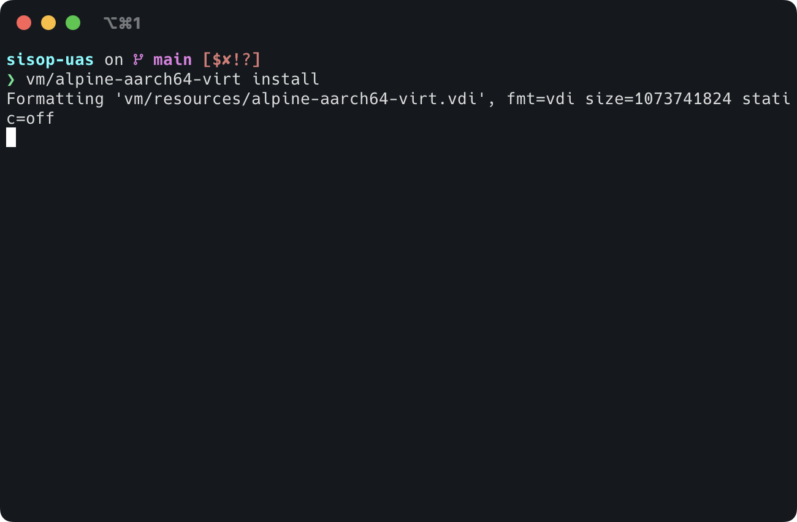

# Instalasi dan Konfigurasi Server

## Instalasi Sistem Operasi pada Server

Sebelum memulai instalasi sistem operasi pada server, pastikan VM (Virtual
Machine) server telah disiapkan dan dapat melakukan boot menggunakan file ISO
yang sesuai. Pada panduan ini, kita akan menggunakan Alpine Linux sebagai sistem
operasi server. Alpine Linux dipilih karena ringan, aman, dan sangat cocok untuk
server.

1. Berikan izin eksekusi pada skrip instalasi dengan menjalankan perintah
   berikut pada terminal. Perintah ini memungkinkan skrip dapat dieksekusi oleh
   sistem:

   ```bash
   chmod +x alpine-aarch64-virt
   ```

   Pastikan untuk menyesuaikan nama skrip jika Anda menggunakan nama file yang
   berbeda.

2. Mulai proses instalasi dengan menjalankan skrip menggunakan perintah:

   ```bash
   ./alpine-aarch-virt install
   ```

   Skrip ini akan melakukan beberapa tugas otomatis termasuk mengunduh file ISO
   Alpine Linux jika belum tersedia di sistem Anda, membuat disk virtual baru
   jika diperlukan, dan memulai proses instalasi dasar.

   

3. Sistem akan memulai proses persiapan instalasi. Pada tahap ini, skrip akan
   mengunduh file ISO Alpine Linux jika belum tersedia dan menyiapkan disk
   virtual untuk instalasi.

   

4. Setelah proses persiapan selesai, sistem akan melakukan booting menggunakan
   ISO Alpine Linux. Tampilan ini mengindikasikan bahwa proses boot telah
   berhasil dan sistem siap untuk instalasi.

   

5. Pada prompt login yang muncul, masukkan username `root`. Pada tahap ini,
   belum diperlukan password karena sistem masih dalam mode live ISO.

   

6. Setelah berhasil login, terminal akan menampilkan informasi sistem Alpine
   Linux. Ini menandakan bahwa Anda telah berhasil masuk ke sistem live dan siap
   untuk memulai instalasi.

   

7. Mulai proses instalasi dengan mengetikkan perintah `setup-alpine`. Perintah
   ini akan memulai wizard instalasi interaktif Alpine Linux yang akan memandu
   Anda melalui proses konfigurasi sistem.

   

8. Masukkan hostname untuk server Anda, misalnya `sisop-server`. Hostname ini
   akan digunakan sebagai identifikasi server dalam jaringan. Pilih nama yang
   mudah diingat dan sesuai dengan fungsi server.

   

9. Sistem akan meminta konfigurasi untuk interface eth0 (jaringan NAT/shared).
   Tekan Enter untuk melanjutkan dengan konfigurasi default. Interface ini
   biasanya digunakan untuk koneksi internet.

   

10. Untuk konfigurasi IP pada eth0, tekan Enter untuk menggunakan DHCP. DHCP
    akan secara otomatis mengatur alamat IP, gateway, dan DNS server untuk
    interface ini.

    

11. Selanjutnya adalah konfigurasi interface eth1 (jaringan bridged). Interface
    ini biasanya digunakan untuk koneksi ke jaringan lokal.

    

12. Untuk eth1, ketik `none` karena konfigurasi detail akan dilakukan pada tahap
    selanjutnya setelah instalasi selesai.

    

13. Ketika ditanya untuk membuka file konfigurasi, tekan Enter untuk melanjutkan
    tanpa modifikasi tambahan.

    

14. Masukkan password untuk akun root. Pilih password yang kuat dengan kombinasi
    huruf, angka, dan karakter khusus. Password ini sangat penting untuk
    keamanan server Anda.

    

15. Ketik ulang password root untuk konfirmasi. Pastikan tidak ada kesalahan
    dalam pengetikan password.

    

16. Masukkan `Asia/Jakarta` untuk mengatur zona waktu. Pengaturan zona waktu
    yang tepat penting untuk log sistem dan penjadwalan tugas.

    

17. Untuk pengaturan proxy, tekan Enter jika Anda tidak menggunakan proxy. Jika
    server Anda berada di belakang proxy, masukkan detail konfigurasi proxy di
    sini.

    

18. Untuk server NTP, masukkan `none` karena kita akan menggunakan waktu dari
    host OS. NTP biasanya digunakan untuk sinkronisasi waktu dengan server waktu
    internet.

    

19. Tekan Enter untuk menggunakan mirror repository default. Mirror ini
    digunakan untuk mengunduh paket dan pembaruan sistem.

    

20. Tekan Enter untuk melewati pembuatan user tambahan karena kita akan
    menambahkannya nanti setelah instalasi selesai.

    

21. Tekan Enter untuk menggunakan OpenSSH sebagai SSH server. OpenSSH adalah
    pilihan standar dan aman untuk akses remote ke server.

    

22. Ketik `yes` untuk mengizinkan login root melalui SSH. Meskipun ini tidak
    disarankan untuk lingkungan produksi, ini berguna untuk tahap awal
    konfigurasi.

    

23. Tekan Enter untuk melewati konfigurasi SSH key. SSH key dapat ditambahkan
    nanti untuk keamanan tambahan.

    

24. Masukkan nama disk yang sesuai (biasanya `vda` untuk virtual machine).
    Pastikan Anda memilih disk yang benar karena semua data di disk ini akan
    dihapus.

    

25. Ketik `sys` untuk melakukan instalasi sistem penuh. Mode ini menginstal
    Alpine Linux sebagai sistem operasi permanen pada disk.

    

26. Ketik `y` untuk mengkonfirmasi format disk. PERHATIAN: Langkah ini akan
    menghapus semua data pada disk yang dipilih.

    

27. Tunggu proses instalasi selesai. Sistem akan menginstal semua paket yang
    diperlukan dan mengkonfigurasi sistem dasar.

    

28. Setelah instalasi selesai, ketik `reboot` untuk me-restart sistem. Pastikan
    untuk melepas media instalasi (ISO) agar sistem boot dari disk yang baru
    diinstal.

    

29. Setelah reboot, sistem Alpine Linux Anda siap digunakan. Anda dapat login
    menggunakan akun root dan password yang telah dikonfigurasi sebelumnya.

**Catatan Penting:**

- Simpan password root dengan aman
- Setelah instalasi, disarankan untuk:
  - Membuat user non-root untuk penggunaan sehari-hari
  - Menonaktifkan akses root SSH untuk keamanan
  - Mengkonfigurasi firewall
  - Melakukan update sistem
  - Mengkonfigurasi backup

## Konfigurasi Jaringan Server

Setelah instalasi selesai, Anda perlu mengonfigurasi jaringan pada server.
Alpine Linux menggunakan konfigurasi jaringan berbasis ifup dan ifdown untuk
mengelola interface jaringan.

1. Mengonfigurasi Interface Jaringan Anda dapat mengonfigurasi interface
   jaringan secara manual atau menggunakan file konfigurasi
   /etc/network/interfaces. Untuk konfigurasi statis, contoh pengaturan dapat
   dilakukan sebagai berikut:

   - Edit file konfigurasi jaringan:

     vi /etc/network/interfaces

   - Tambahkan konfigurasi berikut untuk mengatur IP statis:

     iface eth0 inet static address 192.168.1.10 netmask 255.255.255.0 gateway
     192.168.1.1

2. Mengaktifkan Jaringan Untuk mengaktifkan jaringan, jalankan perintah:

   /etc/init.d/networking restart

3. Verifikasi Koneksi Jaringan Setelah konfigurasi jaringan selesai, Anda dapat
   memverifikasi koneksi menggunakan perintah:

   ping 8.8.8.8

   Jika ping berhasil, maka koneksi jaringan telah terkonfigurasi dengan benar.

Instalasi dan Konfigurasi Web Server (FrankenPHP)

Setelah sistem operasi terinstal dan terkonfigurasi dengan baik, Anda dapat
melanjutkan dengan instalasi dan konfigurasi web server menggunakan FrankenPHP
untuk menjalankan WordPress.

1. Menginstal FrankenPHP Untuk menginstal FrankenPHP, jalankan perintah berikut:

   apk add --no-cache php php-fpm php-mysqli php-cli

   Ini akan menginstal PHP dan dependencies yang diperlukan.

2. Mengonfigurasi FrankenPHP untuk WordPress Edit file konfigurasi PHP untuk
   memastikan bahwa PHP-FPM berjalan dengan benar. Biasanya file konfigurasi
   berada di /etc/php/php-fpm.conf. Sesuaikan pengaturan pool PHP-FPM sesuai
   dengan kebutuhan Anda.

3. Menjalankan FrankenPHP Setelah konfigurasi selesai, jalankan FrankenPHP
   dengan perintah:

   /etc/init.d/php-fpm start

4. Verifikasi Instalasi Web Server Anda dapat memverifikasi apakah web server
   berjalan dengan baik dengan mengakses alamat IP server di browser menggunakan
   port yang sesuai (misalnya, http://192.168.1.10:80).

Konfigurasi Layanan dan Keamanan

1. Firewall dan Keamanan Untuk mengamankan server Anda, pastikan untuk
   mengaktifkan firewall dan mengonfigurasi aturan yang diperlukan agar hanya
   port yang diperlukan (misalnya, port 80 untuk HTTP dan port 443 untuk HTTPS)
   yang terbuka.

   Anda dapat menggunakan iptables atau ufw (Uncomplicated Firewall) untuk
   mengelola aturan firewall.

2. Mengonfigurasi Layanan Otomatis Pastikan layanan yang dibutuhkan oleh server
   (seperti PHP-FPM) diatur untuk dimulai secara otomatis saat boot. Gunakan
   perintah berikut untuk mengaktifkan layanan:

   rc-update add php-fpm default

Dengan langkah-langkah tersebut, server Anda akan siap untuk digunakan dan dapat
meng-host aplikasi yang diperlukan.
